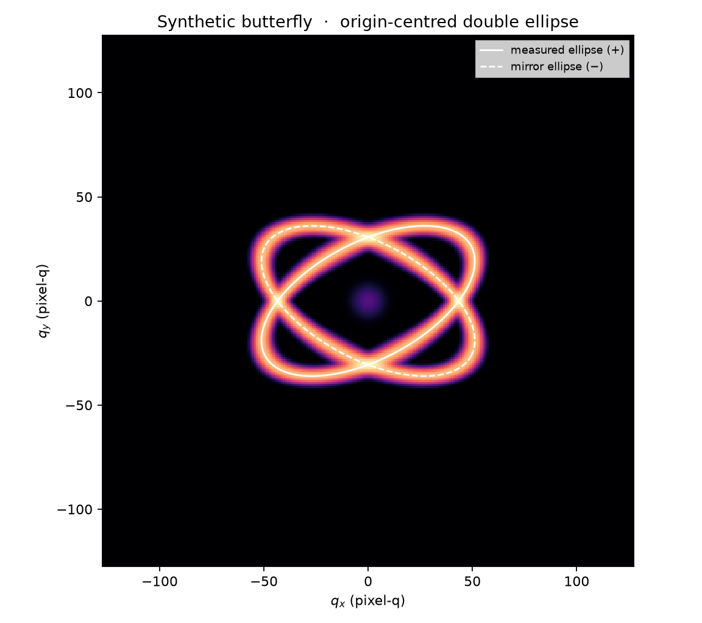

# LamellarSAXS2D

[](https://github.com/D-sudoasd/LamellarSAXS2D/actions/workflows/ci.yml)

[](LICENSE)

**Quantitative refinement and in-situ analysis of anisotropic lamellar 2D SAXS patterns.**

LamellarSAXS2D reads calibrated two-dimensional SAXS detector data, measures anisotropic butterfly/eyebrow features across several scales, fits mirror-constrained double ellipses, and tracks fitted parameters through an in-situ sequence. It preserves the input intensity scale and uses a supplied PONI file to construct physical `q`, `chi`, `qx`, and `qy` coordinates through pyFAI.



The screenshot uses synthetic data and demonstrates the observed, model, residual, and reciprocal-space overlay views.

## Features

- CBF, EDF, TIF/TIFF, NPY, NPZ, HDF5, CSV, and TXT input, including explicit frame/dataset selection.
- PONI-calibrated reciprocal-space maps and explicit masks or exclusion regions.
- Read-only package preflight for manifests, geometry, masks, units, correction state, uncertainty state, and SHA-256 evidence.
- P3 same-model/independent-FFT benchmark generators, an eight-frame blind-annotation pack, and a read-only Go/No-Go evidence gate.
- Radial and azimuthal profiles, lobe measurements, directly observed azimuthal-peak or radial ridge extraction, and q-space symmetric double-ellipse fitting.
- Explicit `flat_ellipse` and `very_flat_ellipse` measurement presets (editable `b/a` bounds; the latter defaults to `0.005–0.35`), deterministic multistart and separate geometry-only remeasurement/refinement.
- Quadrant pairing is defined in the fitted `(q-center)`/reference-axis frame: QI+QIII form one mirrored pair and QII+QIV the other. The fitter never fabricates a missing counterpart; unsupported opposite quadrants remain flagged.
- Optional full-pixel empirical 2D refinement with bounds, fixed parameters, expression constraints, weights, and residual diagnostics.
- Qt workbench with live preview, background optimization, parameter tables, overlays, batch controls, evolution plots, a scroll-safe control dock, and a state-aware next-step guide.
- Independent or quality-gated warm-start processing, selector-aware checkpoints, cooperative cancellation/progress, optional streaming exports, failed-frame isolation, and auditable CSV/JSON/NPZ exports.
- First-run environment diagnostics and a crash-visible GUI launcher that records otherwise silent `pythonw` start-up failures.

## Install from source

Supported Python versions are 3.11–3.13. Python 3.14 and newer are outside this support contract. A project-local environment keeps the desktop launcher and terminal commands on the same interpreter:

```bash
git clone https://github.com/D-sudoasd/LamellarSAXS2D.git
cd LamellarSAXS2D
python -m venv .venv-project
```

Activate the environment, or call its Python directly. On Windows:

```powershell
.\.venv-project\Scripts\python.exe -m pip install --upgrade pip
.\.venv-project\Scripts\python.exe -m pip install `
  -c constraints\validation-py311-313.txt -e ".[all]"
.\.venv-project\Scripts\bsaxs-doctor.exe --require-ui
```

On Linux/macOS:

```bash
.venv-project/bin/python -m pip install --upgrade pip
.venv-project/bin/python -m pip install \
  -c constraints/validation-py311-313.txt -e ".[all]"
.venv-project/bin/bsaxs-doctor --require-ui
```

Core analysis does not require Qt. For core-only use, install with `python -m pip install -e .` and run `bsaxs-doctor` without `--require-ui`.

### Windows desktop launch

The launcher searches `.venv-project`, `.venv`, and `venv` first, then asks
the Windows Python launcher for Python 3.13, 3.12 or 3.11 and prepends this
checkout's `src` directory to `PYTHONPATH`. It does not use the Microsoft
Store `python.exe` alias or install global packages. `--check` requires the
optional UI dependencies; install the project extras in a project environment
when the diagnostic reports a missing `pyqtgraph`/Qt package.

After the environment check passes, double-click `启动_LamellarSAXS2D.cmd`, or run:

```powershell
.\启动_LamellarSAXS2D.cmd data\frame_0001.cbf `
  --poni geometry\detector.poni
```

The launcher searches `.venv-project`, `.venv`, and `venv` before using `PATH`. Use `.\启动_LamellarSAXS2D.cmd --check` to validate the complete desktop-launch chain without opening the GUI. A start-up exception is written to the per-user `LamellarSAXS2D/launcher.log` and its location is shown instead of failing silently. See the [first-run guide](docs/first_run_zh.md).

## Quick start

Create a deterministic synthetic pattern and open it in the workbench:

```bash
bsaxs-doctor --require-ui
bsaxs synthetic --shape 128x128 -o synthetic.npz
bsaxs inspect synthetic.npz
bsaxs-gui synthetic.npz
```

`bsaxs gui synthetic.npz` remains supported; `bsaxs-gui` uses the crash-visible desktop entry point.

Analyze one calibrated detector frame:

```bash
bsaxs inspect data/frame_0001.cbf --poni geometry/detector.poni
bsaxs analyze data/frame_0001.cbf --poni geometry/detector.poni --full2d -o results/frame_0001
```

Track a sequence with quality-gated warm starts:

```bash
bsaxs batch "data/frame_*.cbf" --poni geometry/detector.poni \
  -o results/batch --mode warm_start --checkpoint results/checkpoint.json
```

Validate a real-data package before any fit starts:

```bash
bsaxs preflight data/package --manifest manifest.csv \
  --poni geometry.poni --mask mask.npy \
  -o results/validation/preflight
```

Generate P3 benchmark evidence without fitting real data:

```bash
bsaxs benchmark --suite t1 --seed 20260828 -o results/validation/t1
bsaxs benchmark --suite t2 --shape 256x256 --seed 20260828 -o results/validation/t2
```

Create an R0 blind-annotation pack and inspect the P3 evidence gate (both are read-only with respect to source data):

```bash
bsaxs annotation-pack <R0-package> --rt-manifest <RT-manifest> \
  --hold-manifest <hold-manifest> -o results/validation/annotations/r0_pilot
bsaxs p3-status --t1-manifest <T1-truth_manifest.json> \
  --t2-manifest <T2-truth_manifest.json> \
  --annotation-status <annotation_status.json> \
  --thresholds <acceptance_thresholds.json> \
  -o results/validation/p3_gate/p3_gate_report.json
```

`annotation-pack` prepares eight fixed blind frames with pre-filled identity columns (`blind_id`, coordinate system, and PNG hash); the actual annotation fields remain to be completed. `p3-status` reports `go`/`no_go` from the supplied evidence. A final thresholds file requires each `evidence_sources` record to bind reproducible per-frame human errors, hashed instrument-calibration evidence, or eight consensus-linked pilot results. The gate does not run fitting, freeze thresholds, or forcibly prevent a later-stage command. See the [first-run guide](docs/first_run_zh.md), [user guide](docs/user_guide_zh.md), [P3 benchmark protocol](docs/validation/benchmark_protocol.md), [scientific definitions and limits](docs/scientific_basis_zh.md), and [architecture](docs/architecture_zh.md) for complete contracts.

## Compatibility names

`LamellarSAXS2D` is the application display name. Existing programmatic interfaces remain stable:

- Python distribution: `butterfly-saxs`
- Import package: `butterfly_saxs`
- Main command-line program: `bsaxs`
- Environment diagnostic: `bsaxs-doctor`
- Crash-visible graphical entry point: `bsaxs-gui`
- Existing machine-readable provenance identifiers and project/output contracts

## Scientific scope

The symmetric ellipses and optional `full2d` model are empirical reciprocal-space measurement/refinement models. A successful fit does **not** uniquely recover a three-dimensional lamellar structure or establish a deformation mechanism from one 2D pattern. Structural interpretation requires explicit geometric assumptions and independent experimental evidence.

The implementation is informed by the ellipse and lamellar-pattern analysis discussed by [Wang, Murthy & Grubb (2007), *“Butterfly” small-angle X-ray scattering patterns in semicrystalline polymers are double-elliptical*](https://doi.org/10.1016/j.polymer.2007.04.026), [Grubb, Murthy & Francescangeli (2016)](https://doi.org/10.1002/polb.23930), and [Grubb et al. (2021)](https://doi.org/10.1016/j.polymer.2021.123566). The papers themselves are not redistributed in this repository.

---

## 中文说明

LamellarSAXS2D 面向取向层片体系的各向异性二维 SAXS 花样，提供从像素、剖面、峰脊线到镜像双椭圆和整幅经验强度模型的定量测量，并可跟踪原位序列中的参数演化。软件保留输入强度的数值尺度；当提供 PONI 文件时，通过 pyFAI 生成物理 `q/chi/qx/qy` 坐标。

### 主要能力

- 读取 CBF、EDF、TIF/TIFF、NPY、NPZ、HDF5、CSV/TXT，并显式选择帧或数据集。
- 使用 PONI、外部 mask 和排除 ROI 管理真实探测器几何与有效像素。
- 在拟合前只读检查数据包、manifest、PONI、mask、单位、校正/不确定度状态和输入哈希。
- 生成 P3 同模型/独立 FFT 基准、8 帧盲标包，并提供缺证据即 No-Go 的只读证据门；是否进入下一阶段由团队依据报告决定。
- 提取径向/方位剖面、lobe、ridge，并在 q 空间拟合共享中心和半轴的镜像双椭圆。
- `flat_ellipse` 与 `very_flat_ellipse` 是可编辑的观测几何先验；`very_flat_ellipse` 默认 `b/a=0.005–0.35`，不会覆盖项目中已明确给出的边界。
- 象限配对在 `(q-center)`/reference-axis 坐标中执行：QI+QIII 为一对，QII+QIV 为另一对。软件只使用实际观测到的 ridge 点，不用镜像点补齐缺失象限；缺失对侧、短弧和外推都会保留在 flags/quality/coverage 诊断中。
- `azimuthal_peak` 表示 q annulus 内的观测方位最大值；`radial_peak`/lobe radial profile 才给出沿方位的径向 `q_star`。`full2d` 是另一个使用全有效像素的经验强度模型，三者不互相冒充。
- 可选像素级 `full2d` 经验精修，支持参数边界、固定、表达式绑定、权重和残差诊断。
- Qt 界面提供 Observed、Model、Residual、Overlay 四视图和可编辑参数表；人工修改参数后，Preview 会同步更新经验模型及 Overlay 中的模型双椭圆，Optimize 只作为当前单帧的可选辅助。
- 右侧控制栏采用可滚动布局，并在顶部显示输入、q 标定、mask/ROI、结果状态及“建议下一步”；在笔记本或 980×680 窗口下，底部审核与快照控件仍可访问。
- 顶栏 `语言 / Language` 菜单可在中文和 English 间即时切换；首次启动默认中文，选择保存在应用级 `QSettings` 中，不写入科研项目 JSON，也不改变参数、单位、flags 或审核状态码。
- UI 可保存带备注的参数快照、恢复 Optimize 前状态，并由具名审核者显式 Accept/Reject 当前 Preview 或 Optimize；该人工会话状态不等于科学 PASS。`Export evidence…` 默认不覆盖，固定导出四张诊断图、参数 CSV、会话 JSON 和 provenance JSON。
- 支持独立拟合或质量门控的 warm start、checkpoint 恢复、失败帧隔离及 CSV/JSON/NPZ 可审计导出。
- `bsaxs-doctor` 在打开 GUI 前检查 Python 和核心/UI 依赖；Windows 启动器会记录 `pythonw` 阶段的 traceback，避免双击后无反馈。

### 安装与使用

```powershell
git clone https://github.com/D-sudoasd/LamellarSAXS2D.git
cd LamellarSAXS2D
py -3.13 -m venv .venv-project
.\.venv-project\Scripts\python.exe -m pip install `
  -c constraints\validation-py311-313.txt -e ".[all]"
.\.venv-project\Scripts\bsaxs-doctor.exe --require-ui
.\启动_LamellarSAXS2D.cmd --check
.\启动_LamellarSAXS2D.cmd
```

终端分析命令保持不变：

```bash
bsaxs inspect data/frame_0001.cbf --poni geometry/detector.poni
bsaxs analyze data/frame_0001.cbf --poni geometry/detector.poni --full2d -o results/frame_0001
bsaxs-gui data/frame_0001.cbf --poni geometry/detector.poni
bsaxs preflight data/package --manifest manifest.csv -o results/validation/preflight
```

支持的 Python 版本为 3.11–3.13；3.14 及更高版本不在本项目支持契约内。`annotation-pack` 用于从 R0 清单生成 8 帧只读盲标包，`p3-status` 用于汇总 T1/T2/人工证据并报告 `go`/`no_go`，`p4-evaluate` 用于运行 ridge/lobe/双椭圆工程验证；这些工程报告不替代人工拟合接受或科学证据门。首次启动与标准界面流程见[首次启动指南](docs/first_run_zh.md)，其余详见 [P3 基准协议](docs/validation/benchmark_protocol.md) 和[操作与输入输出指南](docs/user_guide_zh.md)。

批处理、mask、项目配置、字段和失败恢复见[操作与输入输出指南](docs/user_guide_zh.md)；模型参数、单位和可解释性边界见[科学量与解释边界](docs/scientific_basis_zh.md)。

### 科学边界与兼容性

椭圆拟合和 `full2d` 成功，只说明当前经验模型能够描述所选有效像素，不等于完成唯一的三维结构反演或机制判定。跨帧比较应保持 q 标定、mask、权重和配置一致，并结合独立实验解释。

公开展示名为 `LamellarSAXS2D`；为保持现有用户脚本和结果兼容，安装包仍为 `butterfly-saxs`，Python 包仍为 `butterfly_saxs`，主命令仍为 `bsaxs`。

## License

[MIT](LICENSE)
